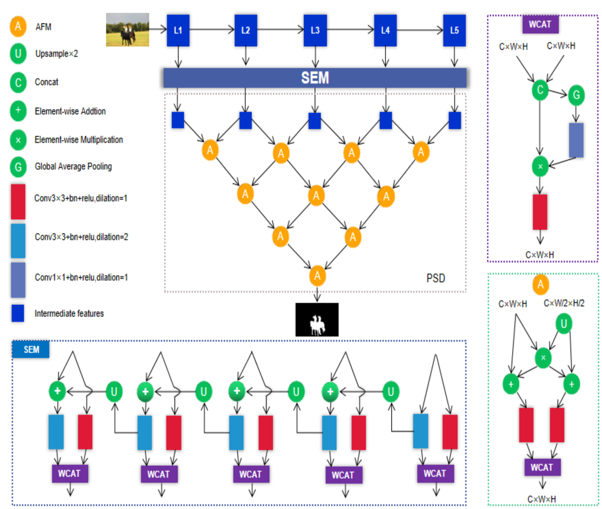
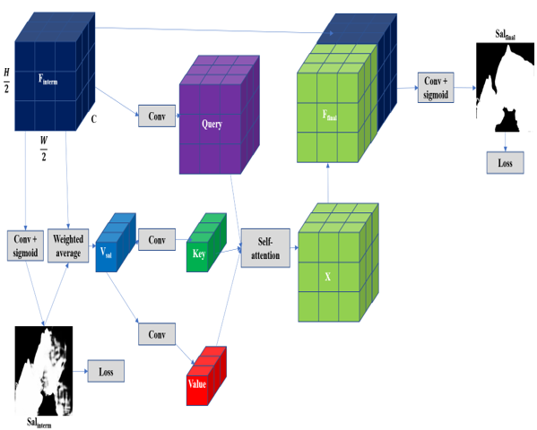
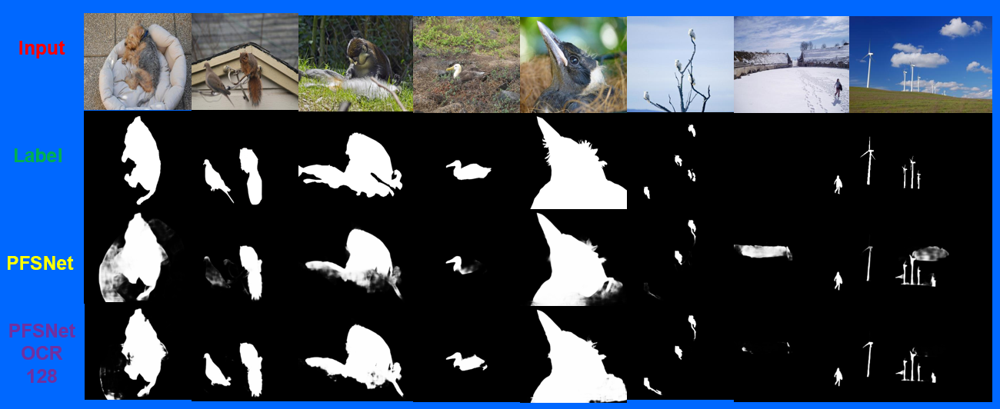

# Graduate thesis
Salient Object Detection (SOD) using the self-attention-based Object Contextual Representation module built on top of the PFSNet model.
## [PFSNet](http://cvteam.net/papers/2021_AAAI_Pyramidal%20Feature%20Shrinking%20for%20Salient%20Object%20Detection.pdf)
1. Backbone
  - Resnet-50
2. Neck/Feature network
  - 2 phases multi-level features integration. Only fuse two adjacent feature maps to avoid feature attenuation.
  - Phase 1 use top-down path feature integration applied on the feature maps obtained from the backbone.
  - Phase 2 use pyramidal shape to fuse 2 adjacent feature maps obtained from phase 1.
  - Channel Attention Module (WCAT in the paper) is applied whenever 2 feature maps are combined.
  - Utilize dilated convolution to increase the model's receptive field (larger receptive field is required for Salient Object Detection > Object Detection > Image classification) 
3. Auxiliary classifier
An intermidiate saliency map is predicted on the final feature map obtained from the neck. 

## [Object Contextual Representation - OCR](https://arxiv.org/pdf/1909.11065.pdf)
Inspired by self-attention based OCR in Semantic segmentation task, implement one for SOD.
A saliency vector which represents the salient intensity is computed by weighted averaging the final feature map in PFSNet with the intermidiate saliency map. This vector acts like a Key and Value in self-attention. The pixel vectors obtained from flattening the final feature map along the spatial axis (H, W) acts as Queries.
The OCR module will adjust the salient intensity of each pixel vector based on the similarity with the saliency vector.

## Results
Results are obtained as the outputs of the model without any post-processing. The OCR module can remove non-salient regions of the image, but also recover salient objects (or its parts) compared to the original PFSNet model. This demonstrates that the feature map obtained from PFSNet contains sufficient salient information of each pixel which can be utilized by OCR to provide global context. As a result, the saliency intensity of each pixel can be adaptively modified based on the whole-image context.

